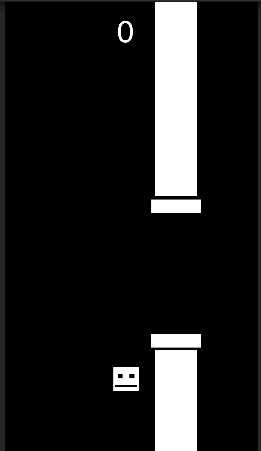

# Flappy Bird Clone 🎮

Este é um **clone simples do Flappy Bird**, criado como **exercício de aprendizagem no Unity**.  
O objetivo principal foi praticar os conceitos básicos de desenvolvimento de jogos, como:
- Física (gravidade e colisões)  
- Input do jogador  
- Spawn de obstáculos  
- Controle de pontuação  

⚠️ **Atenção**:  
Alguns trechos de código podem não estar no melhor padrão ou arquitetura possíveis.  
Isso é intencional, já que o foco deste projeto não foi clean code, mas sim **fixação de conceitos** de criação de jogos no Unity.  

---

## ▶️ Teste o jogo

👉 [Clique aqui para jogar](https://play.unity.com/en/games/dcad8d9e-a154-4eee-b907-9365cdf1b312/minimal-flappy-bird)  

---

## 🛠️ Tecnologias usadas
- Unity (engine de jogos)  
- C# (linguagem de programação)  

---

## 📚 Objetivo do projeto
Este projeto não tem fins comerciais, apenas educativos.  
Foi feito para praticar, aprender e se divertir recriando um jogo clássico.  

---
